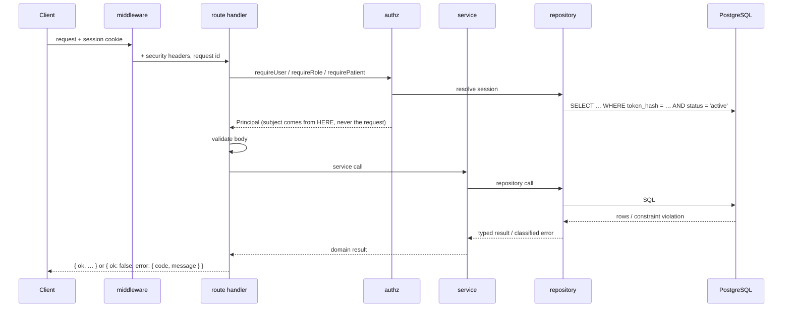
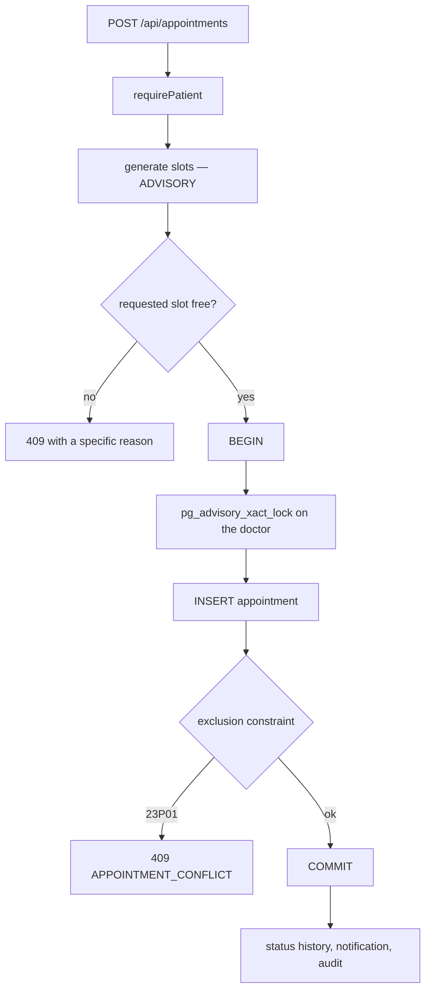
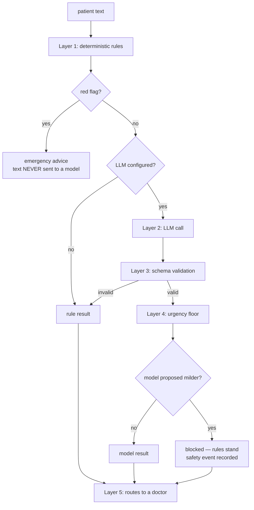
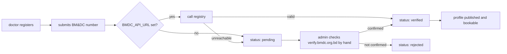

# Architecture

## Layering

```
route handler  →  authenticate  →  authorize  →  validate  →  service  →  repository  →  database
```

A route handler parses and responds. It never contains business logic, never
opens a transaction, and never writes SQL.

```
lib/
  api/            response envelope, route wrapper
  audit/          append-oriented audit log
  auth/           passwords, tokens, cookies, CSRF
  ai/             rules, schemas, triage, summaries
  config/         validated environment
  db/             schema, migrations, client, error classification, retry
  errors/         typed errors → HTTP status
  notifications/  providers + templates
  observability/  structured logging, redaction
  payments/       provider abstraction
  repositories/   the ONLY code that touches the database
  scheduling/     the pure engine
  security/       authorization, rate limiting, headers
  services/       business logic; transactions live here
  video/          provider abstraction
```

ESLint enforces the repository boundary: nothing outside `lib/repositories`,
`lib/services`, `lib/db` and the test harness may import the database client.

## Request flow



## Booking

The property this platform lives or dies on.



The pre-flight check is advisory; **the database is authoritative**. Between
generating slots and writing, another request can take the slot — so we attempt
the insert and let the constraint decide. A `23P01` is the expected outcome of a
lost race, not an exception.

The advisory lock is about liveness, not correctness. Concurrent inserts against
an exclusion constraint deadlock under contention, persistently enough that
retrying does not clear it. Serialising per doctor turns a lock cycle into a
queue. If the lock were removed, bookings would still be **correct** — just
failure-prone. Safety first, liveness on top.

## AI triage



The emergency path never involves a model. Not "the model is told not to
downgrade" — the text is never transmitted, so no prompt-injection payload can
defeat a request that was never made.

## Doctor verification



Pull, not push. There is no path from *submitted* to *verified* that does not
pass through a real registry response or a named human. It never fails open, and
no captcha is solved to get there.

## Data model

See [`DATABASE.md`](DATABASE.md). Twenty-eight tables; the ones that carry the
guarantees are `appointments` (exclusion constraint), `medical_records`
(immutable content, amendment chain), `ai_triage_sessions` (urgency floor) and
`audit_logs` (append-only trigger).

## Serverless shape

- The database client is cached on `globalThis`, so a warm invocation reuses it.
- Connection pools are small (3 in production): pool size multiplies across
  instances, and a large per-instance pool exhausts the server.
- No in-process state is authoritative — not sessions, not rate limits, not job
  state. Each invocation has its own memory, so anything kept there is wrong at
  the moment it matters.
- The Neon HTTP driver is used when the connection string points at Neon: no
  socket to keep warm.

## Timezones

Instants are stored in UTC. Availability is stored as a **local window plus its
IANA zone**, and converted by the engine via `Intl`. Nothing hardcodes UTC+6 —
the prototype did, which also produced a negative hour for any clinic starting
before 06:00 local.
